# H dibaryon from lattice QCD

This repository is a supplementary analysis of the finite volume method in lattice QCD
based on the data from "Weakly bound H dibaryon from SU(3)-flavor-symmetric QCD", 
J. R. Green, A. D. Hanlon, P. M. Junnarkar, H. Wittig,  [arXiv:2103.01054](https://arxiv.org/abs/2103.01054).

- [H dibaryon from lattice QCD](#h-dibaryon-from-lattice-qcd)
- [To Do List](#to-do-list)
- [Gauge configurations](#gauge-configurations)
- [Energy levels & $p\cot\delta$ vs $p^2$](#energy-levels--pcotdelta-vs-p2)
  - [$L = 3.1$ fm](#l--31-fm)
  - [$L = 2.8$ fm](#l--28-fm)
  - [$L = 2.4$ fm](#l--24-fm)
  - [$L = 2.1$ fm](#l--21-fm)
  - [Nf = 2](#nf--2)
- [Summary of phase shifts](#summary-of-phase-shifts)
  - [$La$ : fixed](#la--fixed)
  - [$a$ : fixed](#a--fixed)

# To Do List
- [ ] ERE fitting & binding energy
- [ ] Consistency check between root mean square distance of a shallow bound state and a finite volume box
- [ ] Square well potential demo & finite volume method from eigenvalues

# Gauge configurations

|Label | Nf | L | a [fm] | La [fm] |  m_pi [MeV] |
|------|----|---|--------|---------|-------------|
| N300 | 3  | 48| 0.0498 | 2.4     | 422         |
| N202 | 3  | 48| 0.0642 | 3.1     | 412         |
| H200 | 3  | 32| 0.0642 | 2.1     | 419         |
| B450 | 3  | 32| 0.0762 | 2.4     | 417         |
| H101 | 3  | 32| 0.0865 | 2.8     | 417         |
| U103 | 3  | 24| 0.0865 | 2.1     | 414         |
| A653 | 3  | 24| 0.0992 | 2.4     | 424         |
| E5   | 2  | 32| 0.0658 | 2.1     | 436         |
| E1   | 2  | 32| 0.0658 | 2.1     | 978         |

# Energy levels & $p\cot\delta$ vs $p^2$

Interactive plots are also available.
(see figs/pcot_vs_p2/{label}_pcot_vs_p2.html)

The relation between negative squared momentum vs B.E.
for baryon mass 1.2 GeV and pion mass 420 MeV.

## $L = 3.1$ fm
* $a = 0.0642$ fm

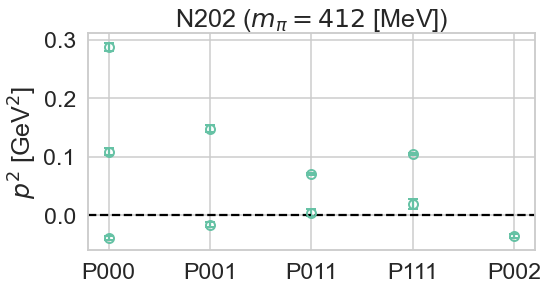
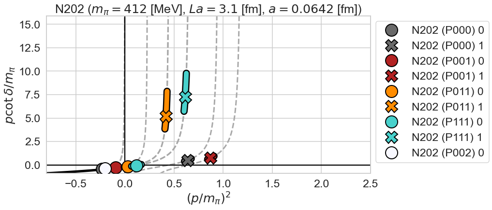

## $L = 2.8$ fm
* $a = 0.0865$ fm

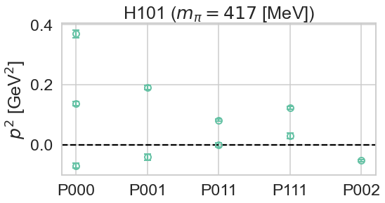

## $L = 2.4$ fm
* $a = 0.0498$ fm

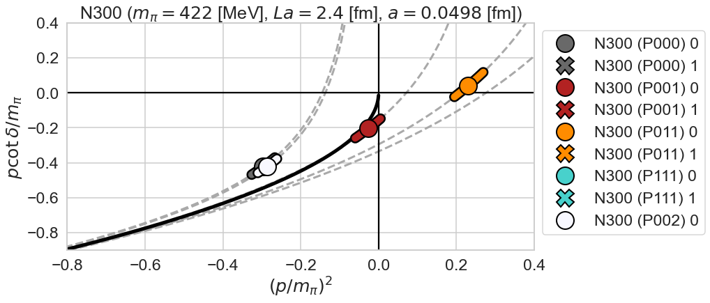

* $a = 0.0762$ fm

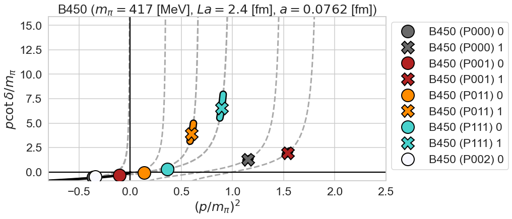

* $a = 0.0992$ fm

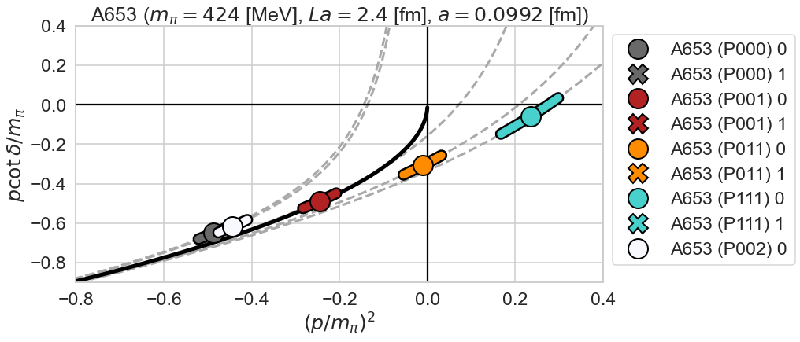

## $L = 2.1$ fm
* $a = 0.0642$ fm

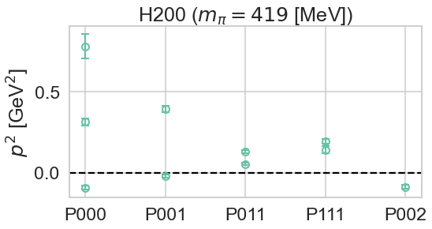

* $a = 0.0865$ fm

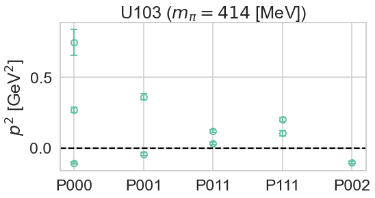

## Nf = 2

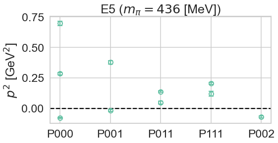

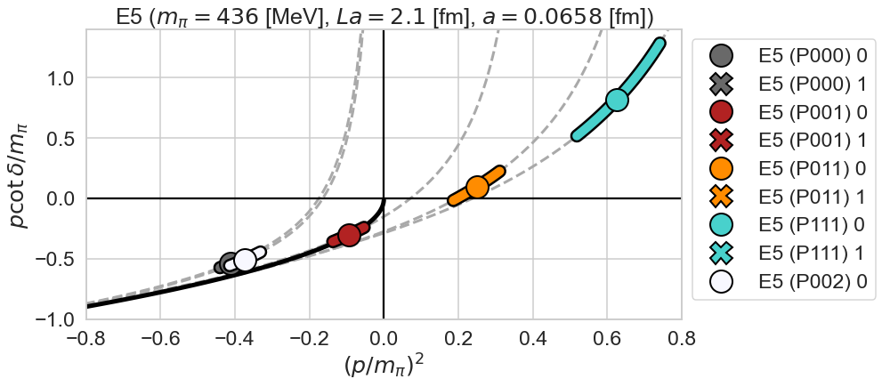

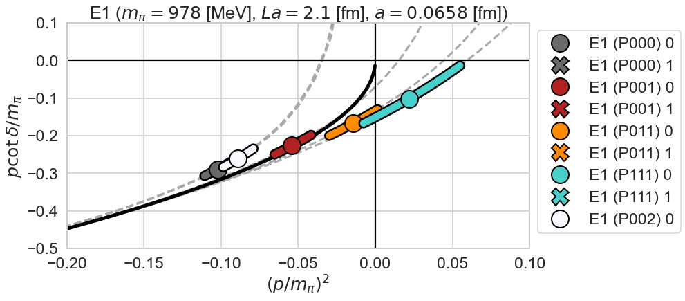

# Summary of phase shifts

## $La$ : fixed

## $a$ : fixed

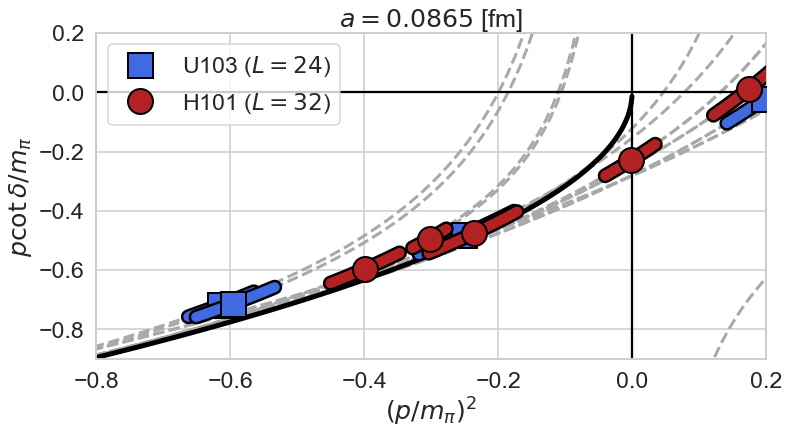
