# H dibaryon from lattice QCD

This repository is a supplementary analysis of the finite volume method in lattice QCD
based on the data from "Weakly bound H dibaryon from SU(3)-flavor-symmetric QCD", 
J. R. Green, A. D. Hanlon, P. M. Junnarkar, H. Wittig,  [arXiv:2103.01054](https://arxiv.org/abs/2103.01054).

- [H dibaryon from lattice QCD](#h-dibaryon-from-lattice-qcd)
- [To Do List](#to-do-list)
- [Gauge configurations](#gauge-configurations)
- [Energy levels & $p\cot\delta$ vs $p^2$](#energy-levels--pcotdelta-vs-p2)
  - [Effective Range Expansion (ERE) analysis (NLO)](#effective-range-expansion-ere-analysis-nlo)
  - [$L = 3.1$ fm N202 ensemble ($a = 0.0642$ fm)](#l--31-fm-n202-ensemble-a--00642-fm)
    - [ERE analysis](#ere-analysis)
  - [$L = 2.8$ fm H101 ensemble ($a = 0.0865$ fm)](#l--28-fm-h101-ensemble-a--00865-fm)
    - [ERE analysis](#ere-analysis-1)
  - [$L = 2.4$ fm N300 ensemble ($a = 0.0498$ fm)](#l--24-fm-n300-ensemble-a--00498-fm)
    - [ERE analysis](#ere-analysis-2)
  - [$L = 2.4$ fm B450 ensemble ($a = 0.0762$ fm)](#l--24-fm-b450-ensemble-a--00762-fm)
    - [ERE analysis](#ere-analysis-3)
  - [$L = 2.4$ fm A653 ensemble ($a = 0.0992$ fm)](#l--24-fm-a653-ensemble-a--00992-fm)
    - [ERE analysis](#ere-analysis-4)
  - [$L = 2.1$ fm H200 ensemble ($a = 0.0642$ fm)](#l--21-fm-h200-ensemble-a--00642-fm)
    - [ERE analysis](#ere-analysis-5)
  - [$L = 2.1$ fm U103 ensemble ($a = 0.0865$ fm)](#l--21-fm-u103-ensemble-a--00865-fm)
    - [ERE analysis](#ere-analysis-6)
  - [Nf = 2 E5 ensemble ($La = 2.1$ fm, $a = 0.0658$ fm, $m_\pi = 436$ MeV)](#nf--2-e5-ensemble-la--21-fm-a--00658-fm-m_pi--436-mev)
    - [ERE analysis](#ere-analysis-7)
  - [Nf = 2 E1 ensemble ($La = 2.1$ fm, $a = 0.0658$ fm, $m_\pi = 978$ MeV)](#nf--2-e1-ensemble-la--21-fm-a--00658-fm-m_pi--978-mev)
    - [ERE analysis](#ere-analysis-8)
- [Summary of phase shifts](#summary-of-phase-shifts)
  - [$La$ : fixed](#la--fixed)
  - [$a$ : fixed](#a--fixed)
- [First excited states for P011 and P111](#first-excited-states-for-p011-and-p111)
- [Finite volume potential](#finite-volume-potential)

# To Do List
- [X] ERE fitting & binding energy
- [X] Check imaginary (?) state P011, P111 first excited state versus ERE
- [X] HAL potential inside a small box

# Gauge configurations

|Label | Nf | L | a [fm] | La [fm] |  m_pi [MeV] |
|------|----|---|--------|---------|-------------|
| N300 | 3  | 48| 0.0498 | 2.4     | 422         |
| N202 | 3  | 48| 0.0642 | 3.1     | 412         |
| H200 | 3  | 32| 0.0642 | 2.1     | 419         |
| B450 | 3  | 32| 0.0762 | 2.4     | 417         |
| H101 | 3  | 32| 0.0865 | 2.8     | 417         |
| U103 | 3  | 24| 0.0865 | 2.1     | 414         |
| A653 | 3  | 24| 0.0992 | 2.4     | 424         |
| E5   | 2  | 32| 0.0658 | 2.1     | 436         |
| E1   | 2  | 32| 0.0658 | 2.1     | 978         |

Summary of binding energies and their cutoff/volume dependence.
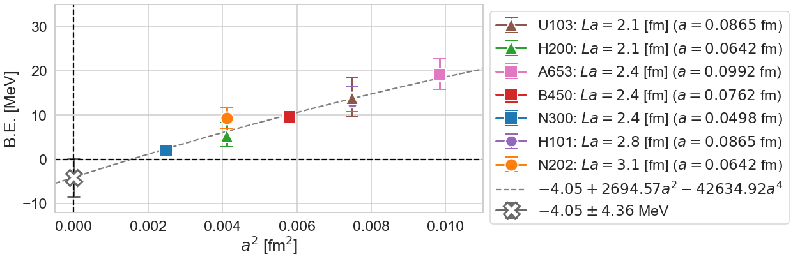

* These binding energies are obtained as follows.

1. Calculate the scattering phase shifts $\delta$ of level = 0 states for P000, P001, P011, P111 and P002 frames with total spin-zero. The errors are estimated from 95CI of bootstrap samples.
2. Fit these 5 points using NLO ERE (next leading order effective range expansion) with the finite volume formula constraints correctly. In some ensembles (H200, B450, and U103) P111 level is ignored due to tension between other levels.
3. Measure the intersection between NLO ERE and binding state condition $-\sqrt{-k^2}$, which can be converted into the binding energy.
4. Take continuum limit.

# Energy levels & $p\cot\delta$ vs $p^2$

Interactive plots are also available.
(see figs/pcot_vs_p2/{label}_pcot_vs_p2.html)

The relation between negative squared momentum vs B.E.
for baryon mass 1.2 GeV and pion mass 420 MeV.

## Effective Range Expansion (ERE) analysis (NLO)

NLO order ERE fitting
$k\cot\delta = 1/a_0 + \frac{1}{2}r_\mathrm{eff}k^2$

$a_0$: scattering length
$r_\mathrm{eff}$: effective range

* For the fitting, we employ 5 data points ($n = 0$ level spectra for P000, P001, P011, P111, and P200 frames with total spin-zero.
* We take into account the finite volume constraints correctly.

## $L = 3.1$ fm N202 ensemble ($a = 0.0642$ fm)

### ERE analysis

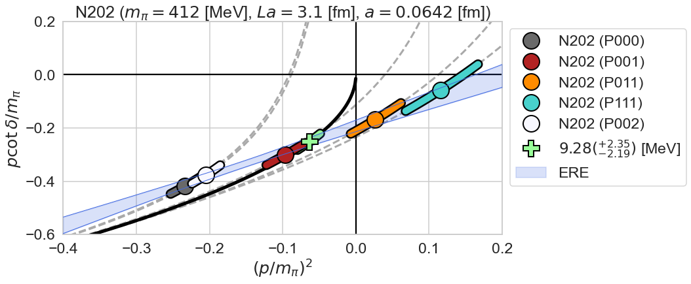

## $L = 2.8$ fm H101 ensemble ($a = 0.0865$ fm)

### ERE analysis

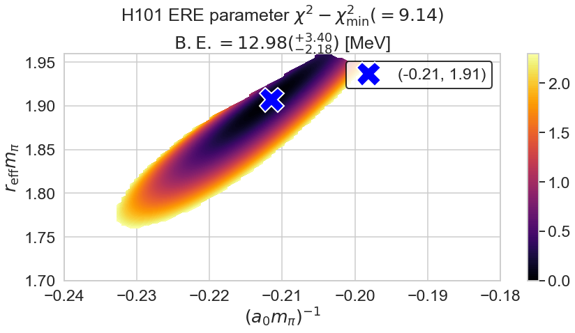

## $L = 2.4$ fm N300 ensemble ($a = 0.0498$ fm)

### ERE analysis

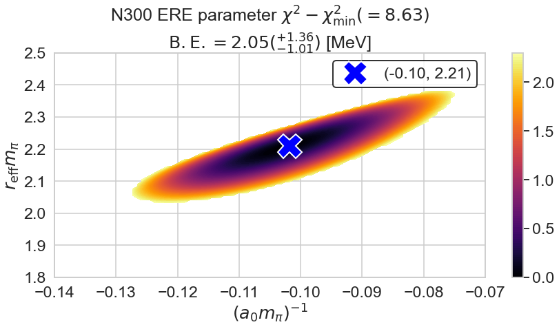
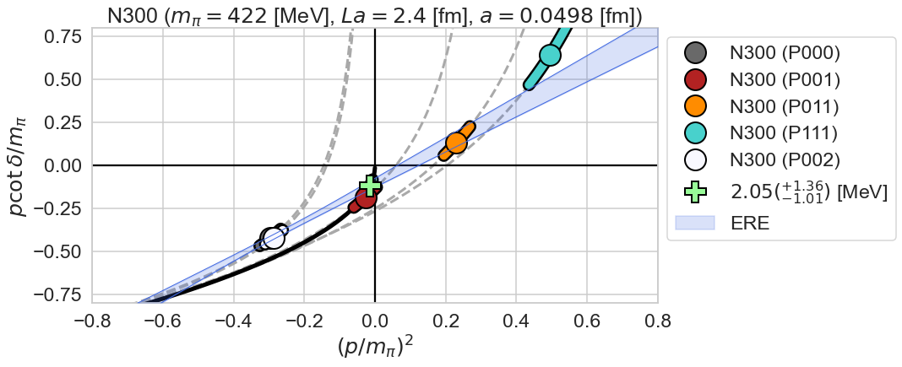

## $L = 2.4$ fm B450 ensemble ($a = 0.0762$ fm)

### ERE analysis

Here, we ignore P111 from ERE fitting.

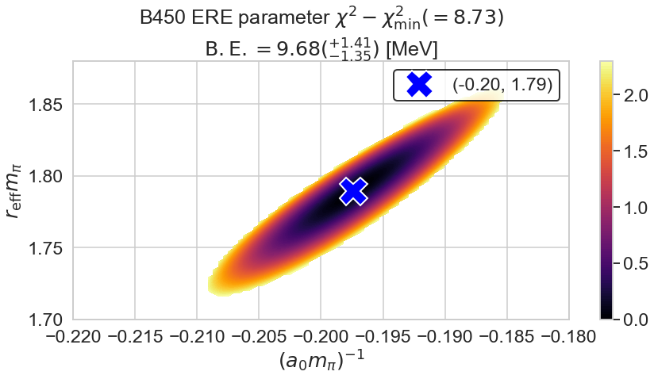
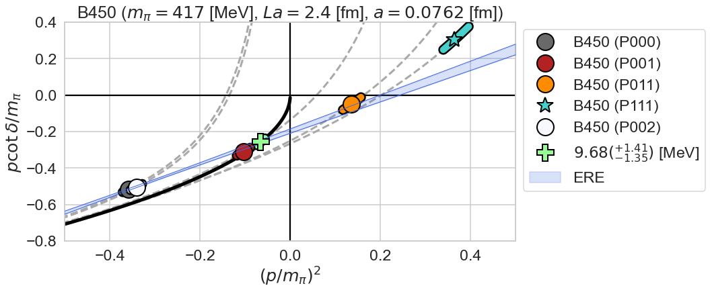
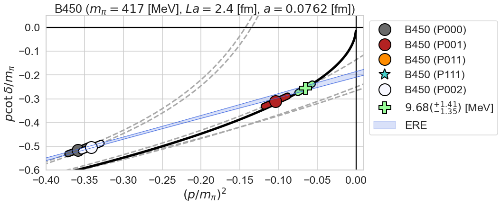

## $L = 2.4$ fm A653 ensemble ($a = 0.0992$ fm)

### ERE analysis

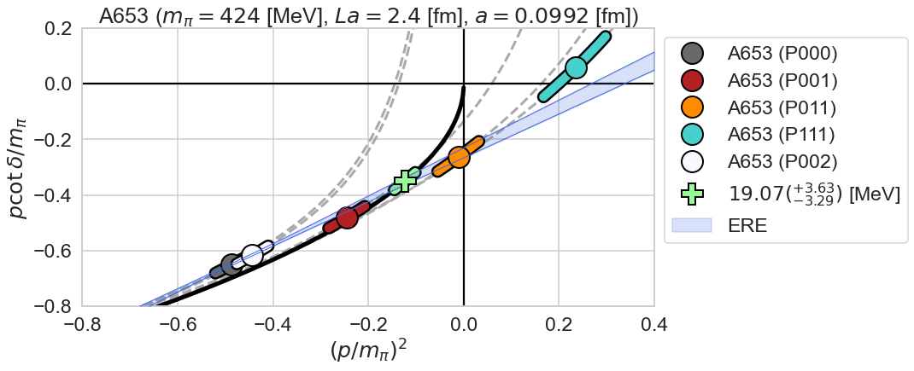

## $L = 2.1$ fm H200 ensemble ($a = 0.0642$ fm)

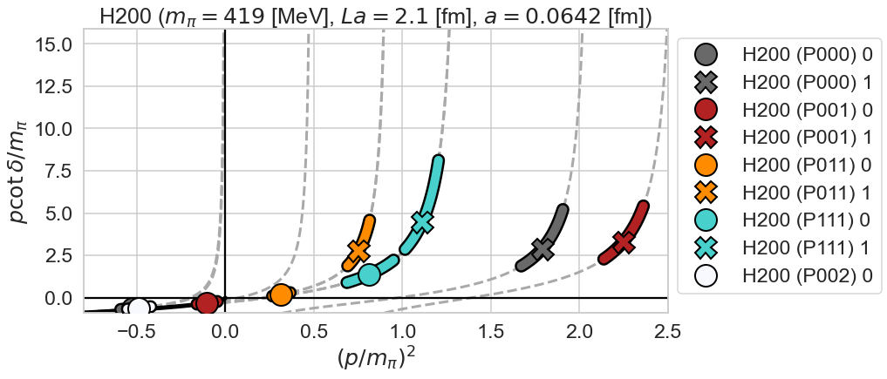

### ERE analysis

Here, we ignore P111 from ERE fitting.

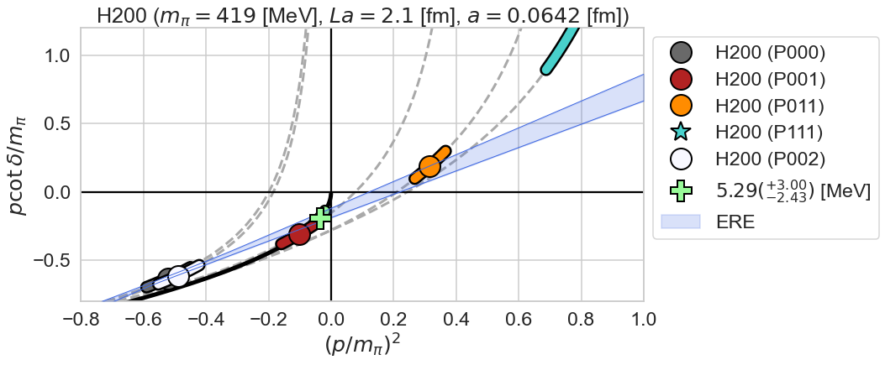
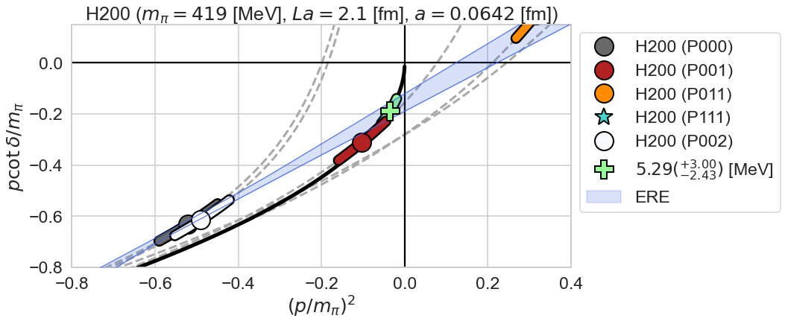

## $L = 2.1$ fm U103 ensemble ($a = 0.0865$ fm)

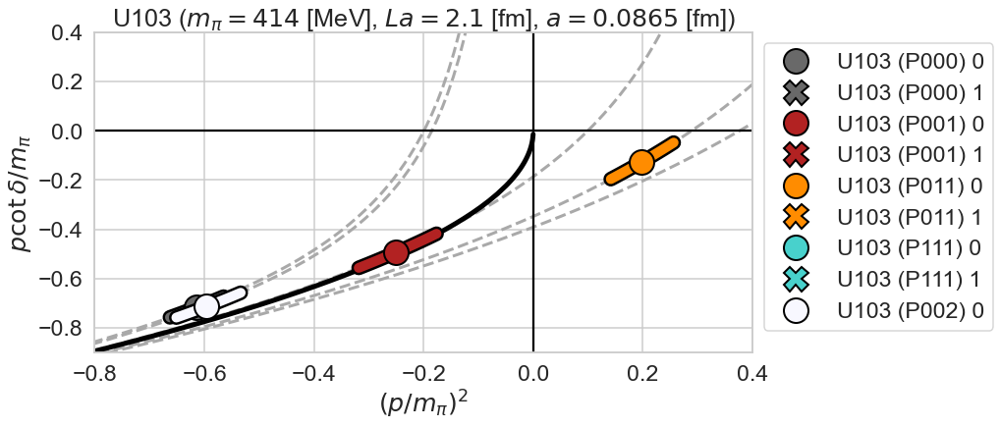

### ERE analysis

Here, we ignore P111 from ERE fitting.

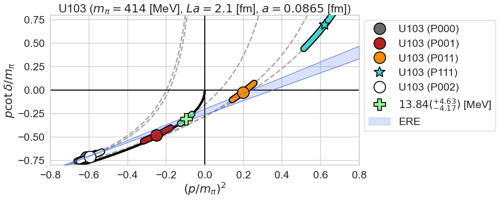
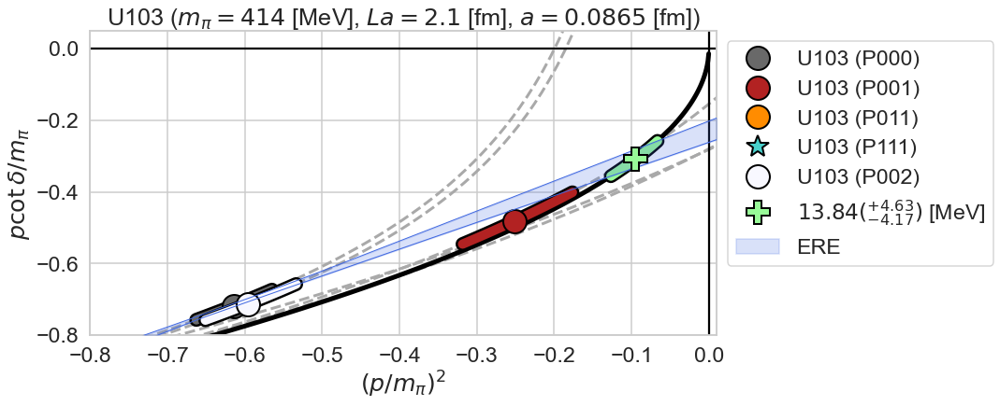

## Nf = 2 E5 ensemble ($La = 2.1$ fm, $a = 0.0658$ fm, $m_\pi = 436$ MeV)

### ERE analysis 

P011 & P111 1st excited states are ignored.

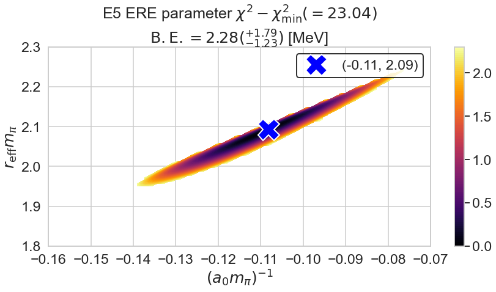

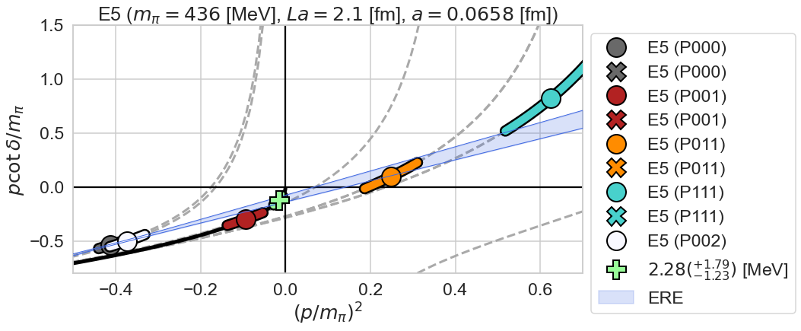

## Nf = 2 E1 ensemble ($La = 2.1$ fm, $a = 0.0658$ fm, $m_\pi = 978$ MeV)

### ERE analysis 

P011 & P111 1st excited states are ignored.

# Summary of phase shifts

## $La$ : fixed
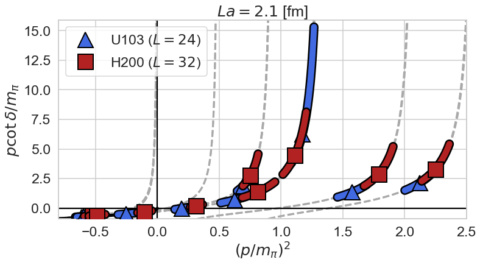
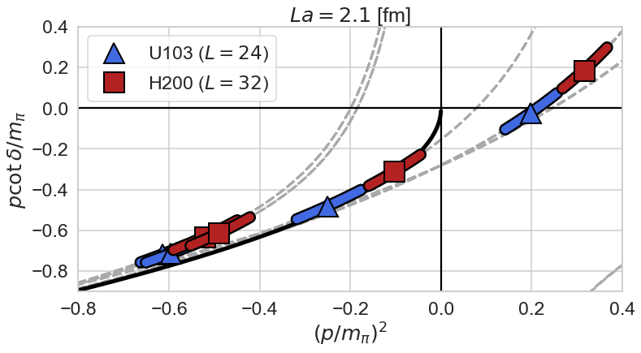

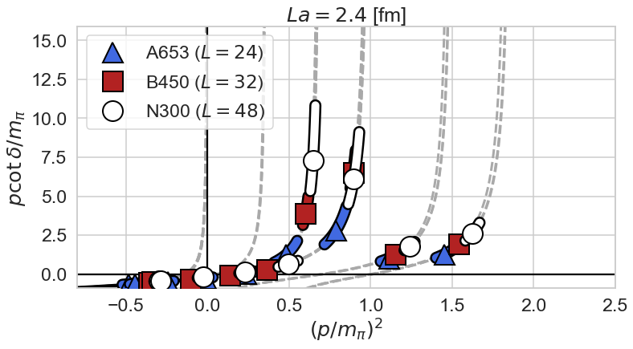

## $a$ : fixed

# First excited states for P011 and P111

ERE fitting using first excited states for P000 and P001, which works well.
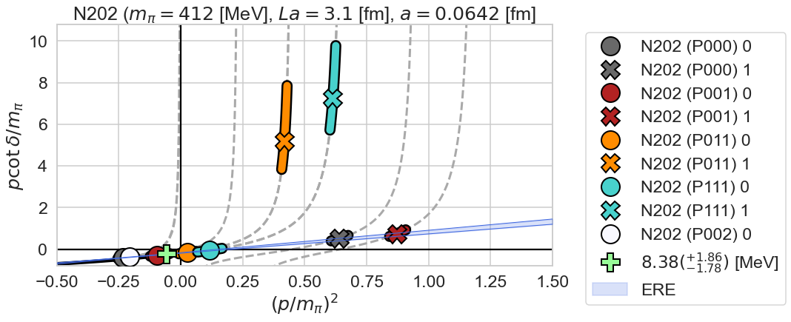

# Finite volume potential

To estimate the systematic uncertainties of finite volume and cutoff,  
we use flavor SU(3) potential at $m_\pi = 837$ MeV with a lattice spacing 0.121 fm.

Here, we consider small boxes such as $L = 8, 12, 16$.

The finite volume spectra at $L = 8$ and 12 show discrepancy.

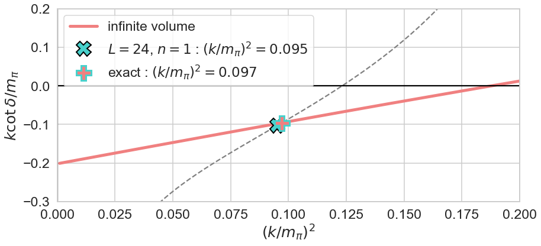

Next, we consider a cutoff dependence of the finite volume eigenvalues.
(Here, we assume the interpolated potential in a = 0.121 fm is consistent with the continuum limit.)

The eigenvalue using coarse lattices are much deeper than the original ones,
while the spectra using a much finer lattice than the one only show small cutoff dependence.

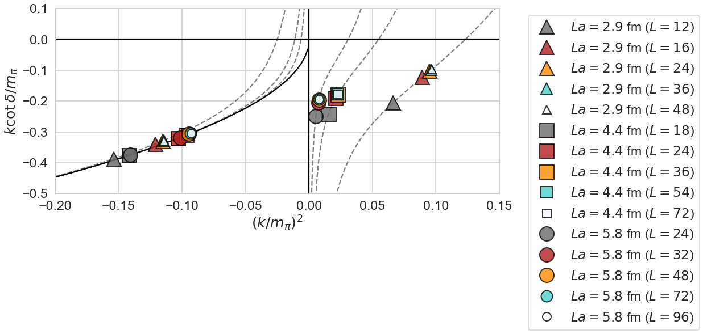

The details of the convergence.

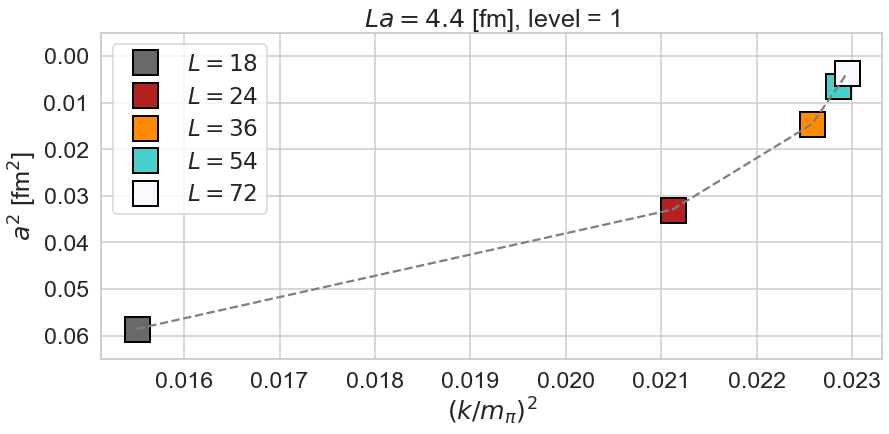

