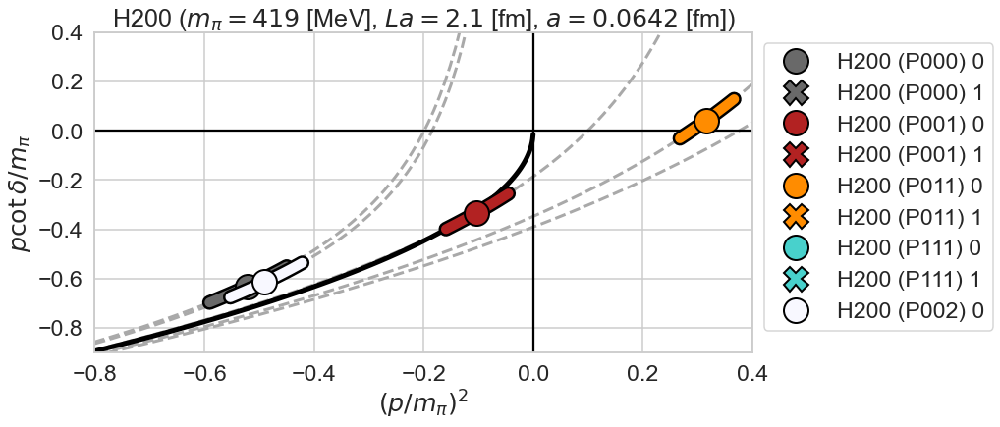
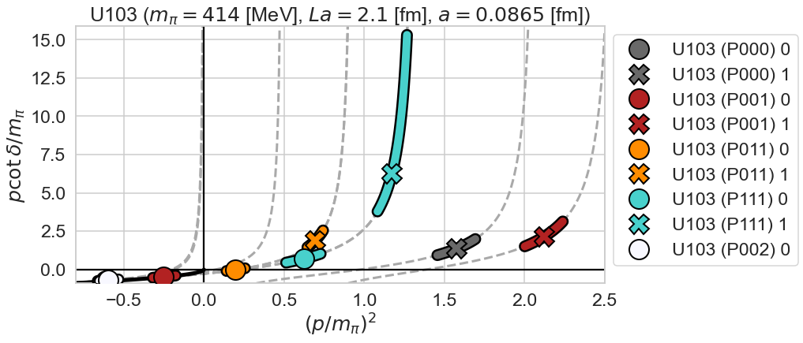

# H dibaryon from lattice QCD

This repository is a supplementary analysis of the finite volume method in lattice QCD
based on the data from "Weakly bound H dibaryon from SU(3)-flavor-symmetric QCD", 
J. R. Green, A. D. Hanlon, P. M. Junnarkar, H. Wittig,  [arXiv:2103.01054](https://arxiv.org/abs/2103.01054).

# $p\cot\delta$ vs $p^2$
## $L = 3.1$ fm
* $a = 0.0642$ fm

## $L = 2.8$ fm
* $a = 0.0865$ fm

## $L = 2.4$ fm
* $a = 0.0498$ fm

* $a = 0.0762$ fm

* $a = 0.0992$ fm

## $L = 2.1$ fm
* $a = 0.0642$ fm

* $a = 0.0865$ fm

